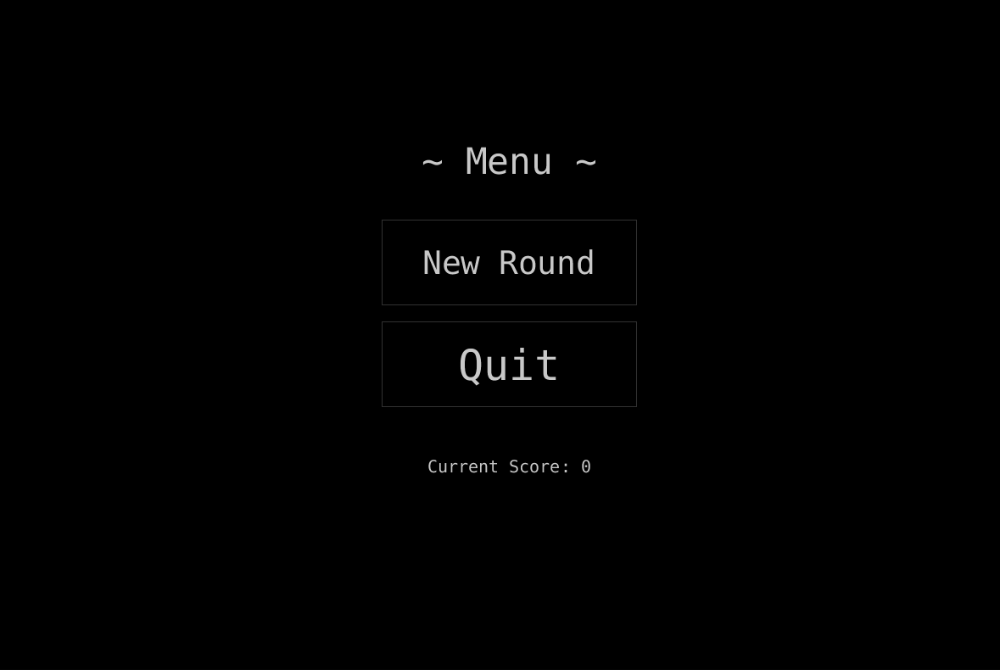
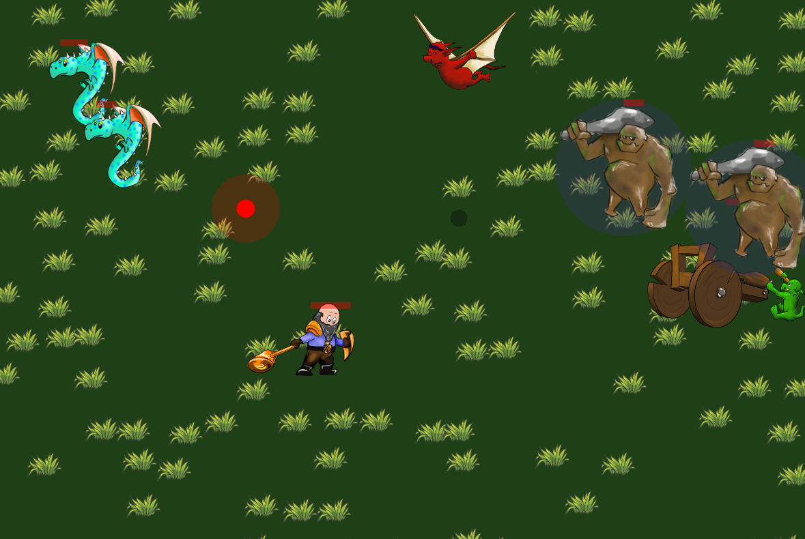
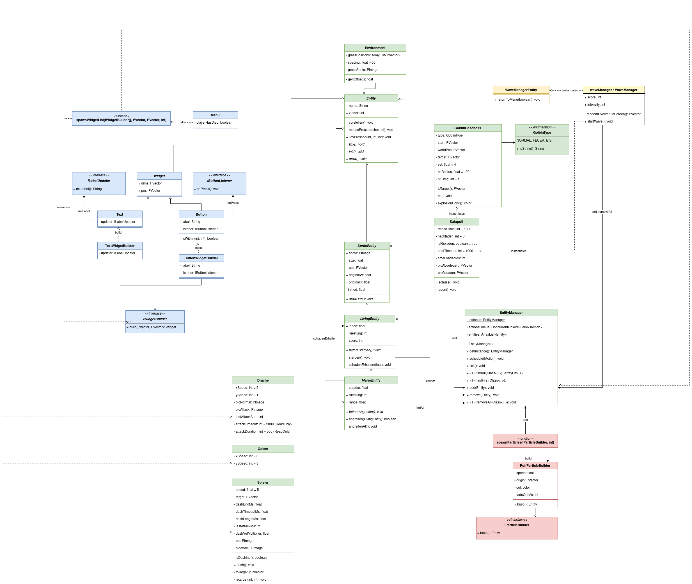

## OO RPG - An RPG written using OOP principles 🕹

<table>
<tr>
<td>Menu</td>
<td>Gameplay</td>
</tr>
<tr>
<td>

</td>
<td>

</td>
</tr>
</table>

# Running
- Uses Processing 3
- Tested on Linux

# Features
- Dash by pressing LSHIFT
- Move somewhere by left-clicking
- Attack using right-click
- Print entity info using 'i'

# Docs
- UML:

